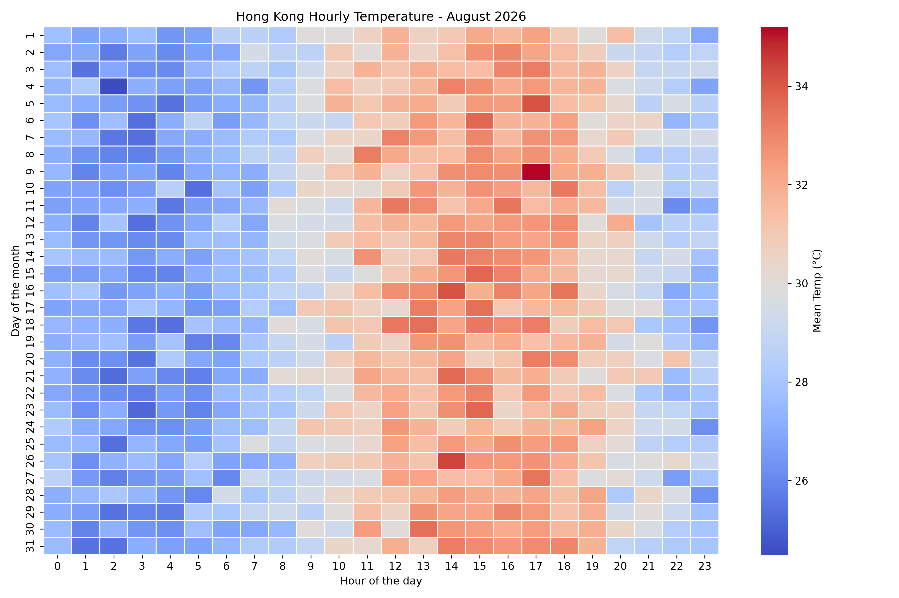

# Hong Kong Diurnal Temperature Fluctuation in August 2026



## The phenomenon

This project investigates the diurnal hourly temperature fluctuations in Hong Kong during August 2026. As a tropical urban metropolis, Hong Kong experiences distinct thermal variations driven by daytime solar radiation and nighttime radiation cooling. Studying these micro-climatic hourly patterns helps us understand urban heat island effects, energy consumption demands for air conditioning, and outdoor human comfort during peak summer months.

## The source

The raw weather dataset originates from the Hong Kong Observatory Open Data page at https://data.gov.hk/en-data/dataset/hk-hko-rss-daily-extract and is locally maintained at `data/daily_temp_2026.csv`. The file contains exactly 744 rows of observations, where each row represents a single hourly micro-climatic recording for all 31 days in August 2026. The values capture the exact timestamp (`YYYY-MM-DD HH:MM:SS`) and the corresponding mean temperature measured in degrees Celsius (°C).

## What the picture shows

The heatmap illustrates the 24-hour daily temperature grid across all 31 days of August 2026. Higher temperatures around 32°C to 34°C are concentrated during midday between 12:00 and 17:00 in red hues, whereas early mornings remain cooler in deep blue tones. However, by aggregating data into uniform hourly blocks, this visualization hides spatial variations across different districts in Hong Kong as well as short-term weather anomalies like sudden rainstorms.

## Run it

```bash
uv run fetch.py
uv run plot.py